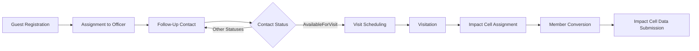
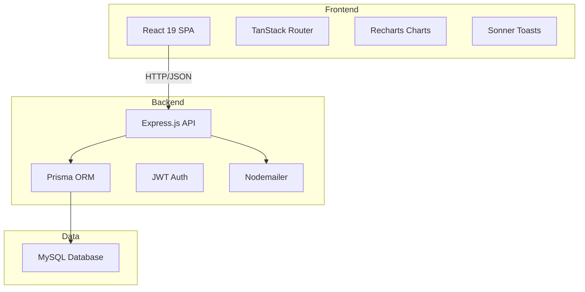

# 01 — System Overview

## Application Purpose

SBC Guest Management (also known as "Follow Up Officer" or "Follow Up & Impact Cell System") is a church management application designed for tracking guests, managing follow-up processes, assigning guests to officers, coordinating impact cell activities, and generating reports. The system serves the administrative needs of a church organization by digitizing guest registration, follow-up workflows, visitation scheduling, impact cell management, and member conversion tracking.

## Primary Users

- **Church Administrators** — Full system oversight, user management, configuration
- **Follow-Up Officers** — Assigned guest follow-up, contact tracking, visitation scheduling
- **Impact Cell Leaders** — Data submission for members, souls, childbirth, weekly reports
- **Supervisors** — View-only oversight of the entire system
- **Impact Cell Admins** — Impact cell oversight, report review, CSV downloads
- **Public Users** — Unauthenticated registration via Join Impact Cell form

## Business Workflow

**Detailed flow:**

1. **Guest Registration** — Guests are added manually by administrators, imported via CSV, or self-register through the public Join Impact Cell form.
2. **Assignment** — Administrators assign guests to Follow UP Officers or Impact Leaders.
3. **Follow-Up Contact** — Assigned officers contact guests and update Contacted Status (No → Yes / AvailableForVisit / NotAvailableForVisit / NotReachable / WrongNumber / Others).
4. **Follow-Up Team Tracking** — Follow_UP role members track status progression (NOT CONTACTED → CONTACTED / WRONG NUMBER / NOT REACHABLE) with up to 3 contact sections.
5. **Visit Scheduling** — Guests marked AvailableForVisit can be scheduled for visitation (Visited/Pending).
6. **Impact Cell Assignment** — Guests are linked to nearest impact cells; leaders track impact status.
7. **Member Conversion** — Guests indicate join intent via joinWhen (FirstTimer, NewMember, OldMember).
8. **Reports & Analytics** — Dashboard KPIs, charts, audit log, officer performance.

## High-Level Architecture

## Current Tech Stack

| Layer | Technology |
|-------|-----------|
| Frontend Framework | React 19 |
| Routing | TanStack Router (with SSR via TanStack Start) |
| UI Components | Radix UI primitives, custom Tailwind CSS |
| Charts | Recharts |
| Forms | React Hook Form (basic usage) |
| Build Tool | Vite |
| Backend | Express.js |
| ORM | Prisma (MySQL) |
| Authentication | JWT (jsonwebtoken + bcryptjs) |
| Email | Nodemailer |
| CSV Parsing | csv-parse/sync |
| Deployment | Node.js server, Cloudflare Workers (Wrangler) |

## High-Level Modules

1. **Authentication & User Management** — Login, password reset, profile updates, role switching, user CRUD (admin only)
2. **Guest Management** — CRUD operations, assignment/reassignment, CSV import/export, filtering, search
3. **Follow-Up Team Dashboard** — Contact tracking with priority sorting, inline status updates, month filtering
4. **Impact Cell System** — Cell management, submissions (members, souls, childbirth, reports), member tracking
5. **Visit Scheduling** — Visitation management for guests with AvailableForVisit status
6. **Notifications** — SMTP configuration, notification rules (email triggers), test email
7. **Reports & Analytics** — Dashboard KPIs, charts (bar, pie, area), audit log, officer performance
8. **Public Join Form** — Unauthenticated impact cell registration form
