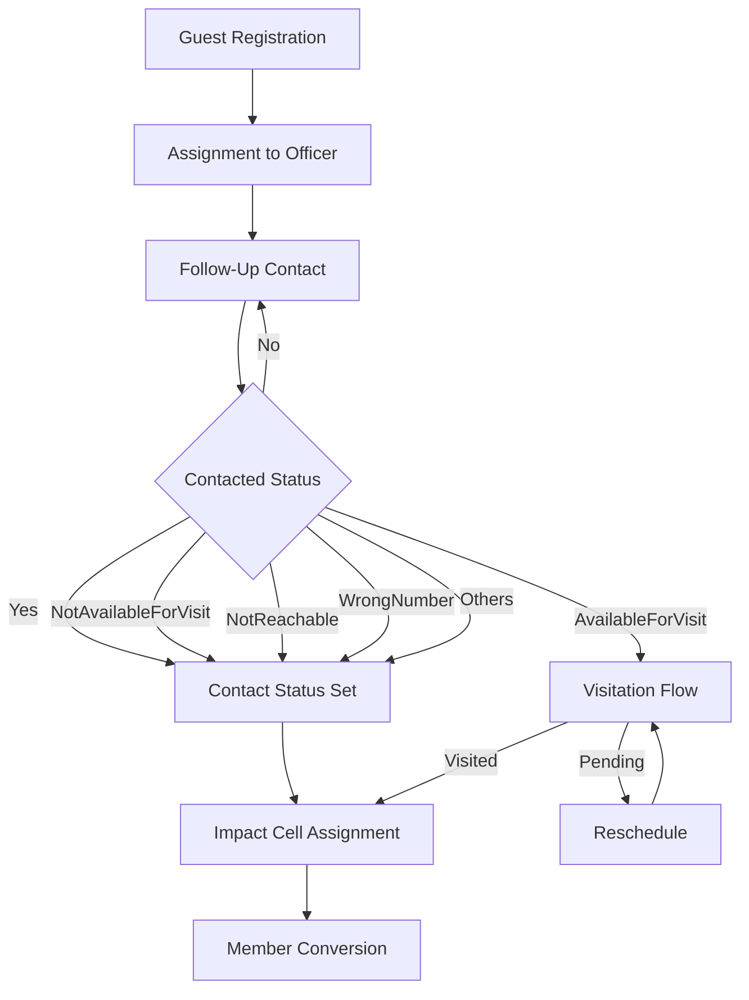
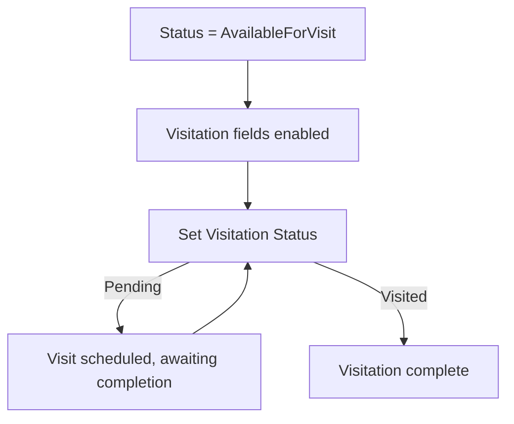

# 04 — Guest Lifecycle

## Complete Lifecycle Flow

## 1. Guest Registration

Guests can be registered through **three channels**:

### A. Manual Add (Admin Only)
- Accessed via "Add Guest" button on `/guests` page
- Form with fields: date, event, eventOther, followOfficer, guestName, gender, maritalStatus, phone, address, age, nearestImpactCell, impactStatus, contactedStatus, joinWhen, visitation details, comments, followUpTeam fields
- Admin role required to access the Add button

### B. CSV Import (Admin Only)
- Accessed via `/import` page
- Three template variants: Follow UP Officer, Follow_UP, Impact Cell
- Duplicate detection by phone number
- Column mapping with alias support
- See [11_System_Features.md](./11_System_Features.md) for details

### C. Public Join Form
- Accessed via `/join-impact-cell` (no authentication required)
- Form fields: event, eventOther (if OTHER), name, phone, gender, nearestImpactCenter
- On success:
  - Guest created with `contactedStatus: "No"` and `followUpStatus: "NOT CONTACTED"`
  - Guest auto-assigned to the first active Impact_Leaders leader of the selected cell
  - Source set to `"PUBLIC_IMPACT_JOIN"`
  - Success message: "Submitted successfully. An Impact Cell leader will contact you."

## 2. Assignment to Follow Up Officer

- Guests can be assigned to officers from:
  - The Add/Edit Guest dialog (select from Follow Officer dropdown)
  - The reassign dialog (admin or Follow_UP Admin only)
- Assignable roles for officers: Follow UP Officer, Follow_UP, Impact_Leaders
- Assignment is tracked via `followOfficerId` foreign key to `User`

## 3. Contact Status Progression

Contacted Status is an enum with the following values:

| Value | Meaning | Next Actions |
|-------|---------|--------------|
| `No` | Not yet contacted | Default; officer should attempt contact |
| `Yes` | Contact successful | Update other fields as needed |
| `AvailableForVisit` | Guest wants a visit | Enable visitation fields (daysAvailable, visitationStatus, feedback) |
| `NotAvailableForVisit` | Guest declined visit | No further visitation actions |
| `NotReachable` | Unable to reach | Attempt later or mark as lost |
| `WrongNumber` | Phone number invalid | Attempt to find correct contact |
| `Others` | Other outcome | Document in comments |

**Important:** When Contacted Status changes away from "AvailableForVisit", the `visitationStatus` and `feedback` fields are automatically cleared.

## 4. Follow Up Status Tracking (Follow_UP team only)

Follow Up Status tracks the workflow for Follow_UP team members:

| Value | Meaning |
|-------|---------|
| `NOT CONTACTED` | Default; awaiting first contact |
| `CONTACTED` | Successfully contacted |
| `WRONG NUMBER` | Phone number is invalid |
| `NOT REACHABLE` | Unable to reach guest |

**Priority sorting:** For assigned-only and follow-up team roles, guests are sorted by Follow Up Status priority:
1. NOT CONTACTED (priority 0) — highest priority, shown first
2. CONTACTED (priority 1)
3. All other statuses / blank (priority 2)

**Follow Up Contacts:** Up to 3 contact sections, each containing:
- `date` — Date of contact
- `contact` — Label (1st Contact, 2nd Contact, 3rd Contact)
- `comments` — Notes about the contact

## 5. Visitation Flow

Triggered when Contacted Status is set to "AvailableForVisit":

**Visitation fields (conditional):**
- `daysAvailable` — Checkbox array of days (Sun–Sat)
- `visitationStatus` — Required when Contacted Status is AvailableForVisit (values: Visited, Pending)
- `feedback` — Free-text visitation notes
- `visited` — Yes/No
- `visitedAt` — Home/Office
- `indicatedToJoin` — Yes/No/Others

**Business rule:** Visitation Status is required when Contacted Status = "AvailableForVisit". The form validates this client-side before saving.

## 6. Impact Cell Assignment

- Guests have a `nearestImpactCell` field (free text or select from existing cells)
- Impact Leaders see an additional `impactStatus` field on assigned guests
- Impact Status values: `Contacted`, `Not Contacted`, `Not Reachable`
- Impact Status is only visible to Impact_Leaders role

## 7. Member Conversion Tracked via `joinWhen`

| Value | Meaning | Display Name |
|-------|---------|-------------|
| `FirstTimer` | New guest, attended for first time within last 2 weeks | "First Timer (Last 2 Weeks)" |
| `NewMember` | Converted to member within last 6 months | "New Members (Last 6 Months)" |
| `OldMember` | Existing/long-standing member | "Old Members" |

This field helps the church track guest-to-member conversion progress.

## 8. Reassignment Between Officers

- Performed via the reassign dialog on the Guests page
- Administrators can reassign to any assignable role officer
- Follow_UP Admin can reassign only to "Follow_UP" role officers
- On reassignment to an Impact_Leaders officer, a notification email is sent (see [09_Notifications.md](./09_Notifications.md))

## 9. State Transitions & Field Clearing Rules

| Transition | Cleared Fields | Reason |
|-----------|---------------|--------|
| ContactedStatus changes from AvailableForVisit to any other status | `visitationStatus`, `feedback` | These fields are only valid when guest is available for visit |
| ContactedStatus changes to AvailableForVisit | None | Fields become editable |
| Guest first created | `visitationStatus = ""`, `feedback = ""` | Default empty until contact status changes |
| Follow Officer cleared | `followOfficer` set to null | Guest becomes unassigned |
